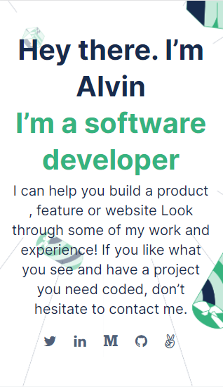

# Portfolio: My-Portfolio-Website

> In this project i am building a My portfolio website using the best practices of git and github flow, by parsing a UI design from figma to create a responsive website.

The main objectives for this project are:

1. To Understand how to parse a Figma design to create a UI.
2. Use of Flexbox to place elements in the page.
3. Build a My portfolio website.
4. Use images and backgrounds to enhance the look of the website.

## [live Demo](https://raw.githack.com/alvinlouis29/Portfolio-website/header-section/index.html)

## To run the project locally :

1. Open it in vscode
2. Open the index.html with live server
## Built With

- Html
- Css

👤 **Alvin Louis**

- GitHub: [@alvinlouis29](https://github.com/alvinlouis29)
- Twitter: [@louisssegawa](https://twitter.com/louisssegawa)
- LinkedIn: [Alvin Louis](https://www.linkedin.com/in/alvin-louis-632026183/)

## 🤝 Contributing

Contributions, issues, and feature requests are welcome!

Feel free to check the [issues page](../../issues/).

## Show your support

Give a ⭐️ if you like this project!

## 📝 License

This project is [MIT](./MIT.md) licensed.
